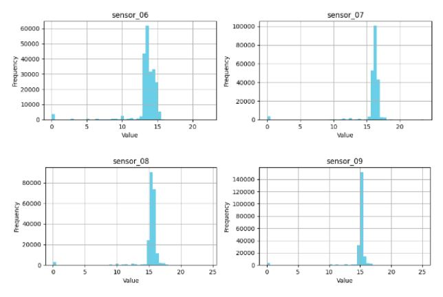
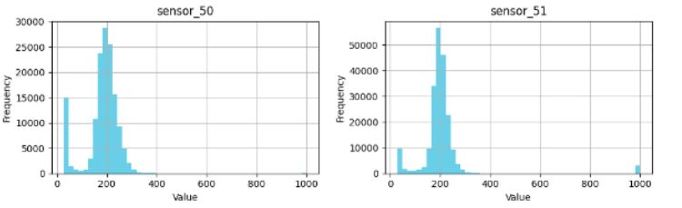

# Predictive Maintenance 
# Water Pumps

I’m Johnathan Yater, a data scientist combining business management know-how with machine learning expertise to solve critical industrial challenges. My latest deep learning model taps into historical sensor data to predict machine failures with high accuracy, allowing businesses to preemptively act, avoiding costly downtime and enhancing operational efficiency.

## Table of Contents
- [Business Problem](#business-problem)
- [Data Insights](#data-insights)
- [Data Preparation and EDA](#data-preparation-and-eda)
- [Models](#models)
- [Results](#results)
- [Recommended Next Steps](#recommended-next-steps)
- [Requirements](#requirements)

## Project Overview
In the modern industrial landscape, the cost of unexpected machine downtime can be substantial, not just in direct repair expenses, but also in lost productivity and the ripple effects on supply chains. A study by Deloitte highlighted that unplanned downtime costs industrial manufacturers an estimated $50 billion annually, with equipment failures being the leading cause of this downtime (Deloitte Insights, 2021). With this in mind, my project is centered on mitigating these costs through predictive maintenance.

Predictive maintenance strategies leverage data driven insights to predict equipment malfunctions before they occur, allowing for timely interventions. The data at the center of my project is historical sensor readings from industrial machines, covering various operational parameters that are often early indicators of potential failures. By applying deep learning techniques to this data, the goal is to model complex patterns and dependencies that can signal potential issues, therefor informing maintenance decisions and scheduling.

This approach is aligned with industry trends where predictive maintenance is becoming an integral component of operational strategies. According to PwC, predictive maintenance can reduce costs by 12%, improve uptime by 9%, and extend the lives of machines by 20% (PwC, 2020). By harnessing the power of machine learning and the wealth of data generated by modern equipment, my project aims to bring these benefits to businesses seeking to improve their maintenance operations and overall productivity.

## Business Problem
In the industrial sector, the malfunction of machinery is a common yet critical issue that can lead to significant production halts and financial losses. To address this, our project set out to create a predictive tool using machine learning to foresee potential failures. Our aim was to offer a proactive solution that could alert maintenance teams to intervene before breakdowns occur, optimizing machine uptime and saving on repair costs.

## Data Insights
In our exploration of the machine sensor data, we discovered that certain sensors were significantly more influential in predicting machine health. The data, drawn from various sensors, suggested patterns that our predictive models could leverage to determine the normal operating parameters and potential faults. We specifically noticed that sensors like sensor_50 and sensor_51 were had missingness and use median and mode on four sensors due to the high amount that were similar within a small range. These insights from the data set the stage for us to build a good model, aiming for an accurate and early diagnosis of potential machine issues that could prevent costly downtimes.

## Data Preparation and EDA
Before diving into modeling, we meticulously prepared the data. This involved cleaning up missing values and unnecessary columns to ensure the quality and integrity of our dataset. For instance, we merged statuses like 'broken' and 'recovering' into a single class to simplify our target variable, and we filled in missing sensor readings with median values to maintain consistency. A key part of our exploratory data analysis was visualizing the distribution of machine statuses and understanding the correlations between different sensor readings. This was a vital step, as it provided the groundwork for building our predictive models by providing a clearer picture of the underlying patterns and relationships within the data.

## Models
We put a series of machine learning models to the test. We started with some regression models as a baseline indicator then focusing on ensemble methods like Bagging, AdaBoost, XGBoost, Stacking, and Voting Classifiers. Each brought its own strengths to the table, whether it was through boosting, where models sequentially learned from the mistakes of previous ones, or stacking, where models' predictions were combined in a sophisticated manner. Our aim was to go beyond individual model performance, looking for an approach that not only provided high accuracy but also showed consistency across different segments of data, which led us to cross-validation techniques, such as gridsearch, for model reliability checks.

## Results
The results were good all around. Our cross-validation approach showed that the models maintained a high level of accuracy across different folds of data, reinforcing their reliability and robustness. The Receiver Operating Characteristic (ROC) curves echoed these findings, with areas under the curve (AUC) being close to 1, indicating excellent predictive performance. The ensemble methods showed a measure of success with increasing the overall successsfeature impact on predictions. All in all the models were consistent with each model.

## Recommended Next Steps
Based on our findings, we recommend further investigation into the high-impact sensors and time series to drill down more into another aspect of predicting their status. Continuous monitoring and real-time analysis of these could yield predictive maintenance schedules, averting failures before they occur. Furthermore, the adoption of the model into a production environment would warrant setting up a pipeline for periodic retraining, ensuring the model stays updated with the latest data and trends.
## Requirements
- Python 3.7+
- Libraries: pandas, numpy, sklearn, tensorflow, keras, matplotlib, seaborn, scikit-learn
- numpy==1.20.3
- scikit-learn==0.24.2
- pandas==1.2.4
- tensorflow==2.5.0
- keras==2.4.3
- matplotlib==3.4.2
- Data: Access to historical sensor data from the target machinery.
- [Sensor Data Set](https://www.kaggle.com/datasets/nphantawee/pump-sensor-data/code)

To replicate the findings or explore the models, clone this repository and ensure you meet the software and data requirements listed above.
## Installation
To set up the environment to run this project, follow these steps:

1. Install required Python packages:

pip install -r requirements.txt

2. Include Version Contro:
   - Use Git for version control and include a `.gitignore` file to avoid pushing unnecessary files to the repository.
   - Make regular commits with clear messages describing the changes.

3. Clear Folder Structure:
   - Use a logical folder structure and include a directory tree in your `README.md`.

## Project Structure
- Pics/
  - Add files via upload/
    - [uploaded image files]
- .gitignore
- Capstone3.0.ipynb
- CapstoneFinal3.0.ipynb
- README.md
- White and Purple Professional Technology Startup Business Company Presentation.pdf
- archive (4).zip

