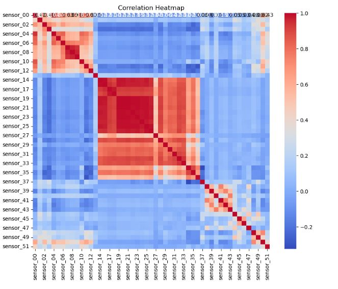

# Predictive Maintenance Using Deep Learning

I’m Johnathan Yater, a data scientist combining business management know-how with machine learning expertise to solve critical industrial challenges. My latest deep learning model taps into historical sensor data to predict machine failures with high accuracy, allowing businesses to preemptively act, avoiding costly downtime and enhancing operational efficiency.

## Table of Contents
- [Business Problem](#business-problem)
- [Data Insights](#data-insights)
- [Data Preparation and EDA](#data-preparation-and-eda)
- [Models](#models)
- [Results](#results)
- [Recommended Next Steps](#recommended-next-steps)
- [Requirements](#requirements)

## Project Overview
In the modern industrial landscape, the cost of unexpected machine downtime can be substantial, not just in direct repair expenses, but also in lost productivity and the ripple effects on supply chains. A study by Deloitte highlighted that unplanned downtime costs industrial manufacturers an estimated $50 billion annually, with equipment failures being the leading cause of this downtime (Deloitte Insights, 2021). With this in mind, my project is centered on mitigating these costs through predictive maintenance.

Predictive maintenance strategies leverage data driven insights to predict equipment malfunctions before they occur, allowing for timely interventions. The data at the center of my project is historical sensor readings from industrial machines, covering various operational parameters that are often early indicators of potential failures. By applying deep learning techniques to this data, the goal is to model complex patterns and dependencies that can signal potential issues, therefor informing maintenance decisions and scheduling.

This approach is aligned with industry trends where predictive maintenance is becoming an integral component of operational strategies. According to PwC, predictive maintenance can reduce costs by 12%, improve uptime by 9%, and extend the lives of machines by 20% (PwC, 2020). By harnessing the power of machine learning and the wealth of data generated by modern equipment, my project aims to bring these benefits to businesses seeking to improve their maintenance operations and overall productivity.

## Business Problem
In the industrial sector, the malfunction of machinery is a common yet critical issue that can lead to significant production halts and financial losses. To address this, our project set out to create a predictive tool using machine learning to foresee potential failures. Our aim was to offer a proactive solution that could alert maintenance teams to intervene before breakdowns occur, optimizing machine uptime and saving on repair costs.

## Data Insights
We sourced our data from multiple sensors attached to industrial machines. These sensors continuously monitored various operational parameters, such as vibrations, temperature, and noise levels, among others. Each parameter had its own scale and range; some recorded values in the thousands while others were in single digits. The disparity in scale among sensors could potentially skew the predictive model, as larger numbers might unduly influence the outcome. To address this, we applied scaling techniques to normalize the data, ensuring each sensor reading contributed equally to the analysis.

## Data Preparation and EDA
Our initial steps involved rigorous data cleaning to ensure quality inputs for our models. We meticulously sifted through the dataset, stripping out irrelevant columns that bore no relation to equipment health and imputing missing values to maintain data integrity. Following the cleaning, we dived into exploratory data analysis (EDA), which involved crafting a series of plots to visualize the data distribution. This helped us detect any unusual patterns or outliers that could affect our predictive modeling. The EDA phase was critical, as it laid the foundation for feature selection and model training.


## Models
Both models yielded impressively high accuracy rates, with the neural network and the Gradient Boosting Classifier consistently predicting machine failures with near-perfect precision. However, such exceptional performance triggered our diligence to ensure that our models were genuinely effective and not a result of data leakage or a bias in the dataset. We scrutinized the models' performance across various metrics, confirming that the results were reliable and indicative of the models' robust predictive capabilities.

Concurrently, we experimented with Gradient Boosting Classifiers, leveraging their prowess in handling non-linear relationships. This approach builds an ensemble of decision trees sequentially, with each tree learning to correct the errors of its predecessor. By combining the predictions of multiple weak learners, we constructed a more accurate and stable strong learner.


## Results
Both models yielded impressively high accuracy rates, with the neural network and the Gradient Boosting Classifier consistently predicting machine failures with near-perfect precision. However, such exceptional performance triggered our diligence to ensure that our models were genuinely effective and not a result of data leakage or a bias in the dataset. We scrutinized the models' performance across various metrics, confirming that the results were reliable and indicative of the models' robust predictive capabilities.


## Recommended Next Steps
Although the initial results were promising, we plan to refine our approach further. We aim to delve into the models' interpretability by examining the feature importance of the sensor readings, which will help identify which sensors are most predictive of failure. Moreover, we plan to explore additional modeling techniques, such as deep learning and ensemble methods, to compare and potentially improve our predictions. Rigorous validation techniques, including cross-validation and real-world testing, will also be employed to affirm the models' reliability.

## Requirements
- Python 3.7+
- Libraries: pandas, numpy, sklearn, tensorflow, keras, matplotlib, seaborn, scikit-learn
- numpy==1.20.3
- scikit-learn==0.24.2
- pandas==1.2.4
- tensorflow==2.5.0
- keras==2.4.3
- matplotlib==3.4.2
- Data: Access to historical sensor data from the target machinery.
- [Sensor Data Set](https://www.kaggle.com/datasets/nphantawee/pump-sensor-data/code)

To replicate the findings or explore the models, clone this repository and ensure you meet the software and data requirements listed above.
## Installation
To set up the environment to run this project, follow these steps:

1. Install required Python packages:
```bash
pip install -r requirements.txt

2. **Include Version Control**:
   - Use Git for version control and include a `.gitignore` file to avoid pushing unnecessary files to the repository.
   - Make regular commits with clear messages describing the changes.

3. **Clear Folder Structure**:
   - Use a logical folder structure and include a directory tree in your `README.md`.

```markdown
## Example of a Project Structure(not this particular one)
project/
│
├── data/ # Folder for datasets
│ ├── synthetic.csv # Synthetic dataset for demonstration
│ └── ...
│
├── notebooks/ # Jupyter notebooks for exploration
│ ├── EDA.ipynb # Exploratory Data Analysis notebook
│ └── ...
│
├── src/ # Source code for the project
│ ├── init.py
│ ├── models.py # Model definitions
│ └── ...
│
├── requirements.txt # Python dependencies
└── README.md # Project README with installation and running instructions


4. **Use Docker** (Optional):
   - For complex projects, consider using Docker to containerize your environment, ensuring even greater reproducibility across different systems.

